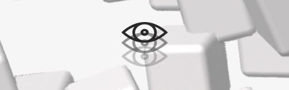

# PsycheVault

  

[PsycheVault](https://psychevault.space/) serves as a comprehensive hub, offering research papers, insights, and educational resources for psychedelics.

This project is back and maintained by **Taiwan Psychedelic Association**, a group of individuals dedicated to promoting the safe and responsible use of psychedelics, as well as advocating for de-demonizing of these substances. If you are interested in psychedelics or this project, feel free to [join us](https://tinyurl.com/3fr2ddu7)!

This project is built on top of [Next.js](https://nextjs.org/), with [Payload](https://payloadcms.com/) v2 served as data source and content management system, and [PsycheLens](https://psychevault.space/research) leverages the power of LLM (e.g. gpt-4o/gemini) to information summarization and data retrieval (mainly with research papers).

## Site Structure

- [**Database**](https://psychevault.space/database): Educational materials to enhance understanding of therapeutic usage of psychedelics.
- [**Research**](https://psychevault.space/research): A collection of research papers and articles on psychedelics and beyond. Research papers are stored in vector database for performing retrieval-augmented generation (PsycheLens).
- [**About**](https://psychevault.space/about): *acinteyya*

## Contributing

We're more than happy to welcome contributions from the community! If you are interested in contributing to this project or to the community, feel free to [reach out to us](https://tinyurl.com/3fr2ddu7).
